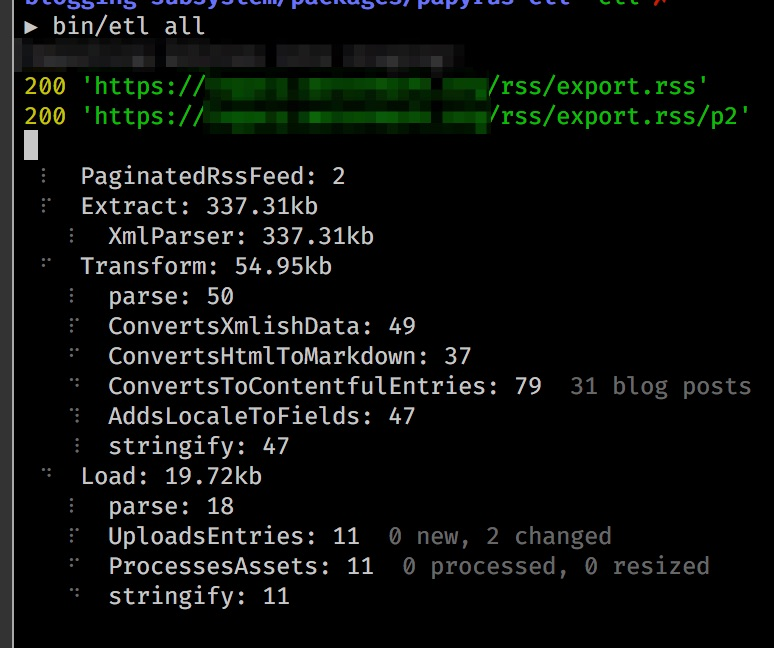

# Async Toolbox

[](https://badge.fury.io/js/async-toolbox)
[](https://travis-ci.org/gburgett/async-toolbox)
[](https://coveralls.io/github/gburgett/async-toolbox?branch=master)

This package contains a number of utilities that have been useful for me in developing
with async code in nodejs and the browser.  It contains a number of tools which
you can require as you desire.

## Utilities

`import { wait, Semaphore, Limiter, promisify, callbackify } from 'async-toolbox'`

* `function wait(ms: number): Promise<void>`  
  Returns a promise which resolves after a given number of milliseconds, using setTimeout.

* `class Semaphore extends EventEmitter`  
    A Semaphore which queues up tasks to be executed once prior tasks are complete.
    Number of concurrent inflight tasks is configurable at initialization.

* `class Limiter extends Semaphore`
    A rate-limiting semaphore which uses [`limiter`](https://www.npmjs.com/package/limiter) to enforce the rate limiting.

* `promisify` and `callbackify`
    Accepts an action which either receives a callback or returns a promise,
    and awaits the appropriate thing.

## Pipeline

`import { Pipeline, StreamProgress } from 'async-toolbox/pipeline'`

The `Pipeline` composes a list of streams into one Duplex stream.  Writing to the `Pipeline` writes to the first stream
in the list, and reading from the `Pipeline` reads from the last stream in the list.

The `StreamProgress` class prints pipeline information to stderr as the pipeline.



### Examples:

* Create a pipeline to read and write from stdin and stdout
```ts
import { Pipeline } from 'async-toolbox/pipeline'
const pipeline = new Pipeline([
  new ParsesXmlToJson(),
  JSONStream.parse(),
  new TransformsJsonObjects(),
  JSONStream.stringify(false)
])
await pipeline.run(process.stdin, process.stdout, { progress: true })
```

* Run a pipeline without any stdin or stdout
```ts
const pipeline = new Pipeline([
  ShellPipe.spawn('yes abcdefgh'),
  ShellPipe.spawn('rev'),
  new SplitLines(),
  new Transform({
    transform(chunk: string, encoding, cb) {
      const str = chunk.toString().slice(1, 4)
      cb(undefined, str)
    },
  }),
  new CombineLines(),
  ShellPipe.spawn('head -n1000 > tmp.txt'),
])
await pipeline.run()
```

* Create a pipeline of pipelines.  This code is copy-pasted from a real extract-
transform-load project that pulled thousands of blog posts from an old CMS into
a new CMS.
```ts
class Extract extends Pipeline {
  constructor() {
    super([
      new DownloadsPaginatedXml(),
      new XmlParser(),
    ])
  }
}

class Transform extends Pipeline {
  constructor() {
    super([
      // parse the lines using JSONStream
      Object.assign(parse(null), { name: 'parse' }),
      new ConvertsXmlishData(),
      new ConvertsHtmlToMarkdown(),
      new ConvertsToContentfulEntries(),
      new AddsLocaleToFields(),
      // stringify the transformed lines separated by newlines
      Object.assign(stringify(false), { name: 'stringify' }),
    ])
  }
}

class Load extends Pipeline {
  constructor() {
    super([
      Object.assign(parse(null), { name: 'parse' }),
      new UploadsEntries(),
      new ProcessesAssets(),
      publish && new PublishesEntries(),
      Object.assign(stringify(false), { name: 'stringify' }),
    ].filter((stream) => !!stream))
  }
}

const extract = new Extract(argv)
const transform = new Transform(argv)
const load = new Load(argv)

const pipeline = new Pipeline([
  extract,
  transform,
  load,
])

await pipeline.run(
  undefined,
  undefined,
  { progress: true }
)
```

## Streams

`import ... from 'async-toolbox/stream'`

Augments the base Readable, Writable, and Duplex streams with new capabilities, and provides a couple extra

* `function toReadable(entries: any[]): Readable`  
  Converts an array of chunks into a readable object stream which can be piped to transforms or writable streams.
* `function collect(stream: Readable): Promise<any[]>`
  Reads all the chunks of a readable stream and collects them in an array.
* `writeAsync(stream: Writable, chunk: any, encoding?: string): Promise<void>`  
  Writes a chunk to the current write stream, returning a promise that completes when the chunk has actually been written.
* `readAsync(stream: Readable size?: number): Promise<any>`  
  Reads a chunk from the current write stream, returning a promise that completes when the chunk has actually been read.
* `class ParallelWritable extends Writable`  
  An extension of a Writable stream which can process chunks in parallel.
* `class ParallelTransform extends Transform`  
  An extension of a Transform stream which can process chunks in parallel.  Ordering is not preserved, because the individual transformations may complete in any order.
* `class SplitLines` and `class CombineLines`
  Converts a string/buffer stream into an Object stream where each chunk is one line, and vice versa.
  Really useful when reading from or writing to a `ShellPipe`.
* `class ShellPipe`
  Wraps `child_process.spawn` in a Duplex stream.  Writing to the stream writes bytes to stdin of the child process,
  while reading from the stream reads from stdout of the child process.  Note that certain programs like `head` will 
  cause an error with `code == 'ERR_STREAM_WRITE_AFTER_END'` once it closes its stdin.  The `Pipeline` class handles
  this by destroying all previous streams.  
  Example:
```ts
await new Pipeline([
  new DownloadsFromApi(),
  ShellPipe.spawn('jq ".entries[].id"'),
  new SplitLines(),
  new Transform({
    transform(line, encoding, cb) {
      // do something with the line here
      cb()
    }
  })
]).run()
```

## Events

`import 'async-toolbox/events'`

Augments the EventEmitter class with new capabilities

* `EventEmitter.onceAsync(event: string | symbol): Promise<any[]>`  
  Returns a promise that resolves the next time the emitter emits the given event.  The promise is rejected if the emitter emits 'error'.

## List

`import { sequential, parallel } from 'async-toolbox/list'`

Creates a chainable monad which facilitates asynchronous transformations of data.

This can be used to replace the following pattern of code:
`await Promise.all(myList.map(async (item) => ...))`

* `sequential(list, options?).flatMap(async (item) => ...)).flatMap(...`
  Creates a monad which executes each async task in sequence, i.e. one at a time.
  Can accept a semaphore implementation which is passed along to each step in the chain.

* `parallel(list, options?).flatMap(async (item) => ...)).flatMap(...`
  Creates a monad which executes all async tasks in parallel, with optionally limited concurrency.
  Can accept a semaphore implementation which is passed along to each step in the chain.

## Request

`import {AsyncRequest} 'async-toolbox/request`

Augments the [Request](https://www.npmjs.com/package/request) NPM library
to make the HTTP methods like `get` and `post` use promises.

```ts
const request = AsyncRequest() // to use standard request lib
const request = AsyncRequest(require('request-debug')(require('request'))) // alternate constructor

const resp = await request.get('http://www.google.com')
```
